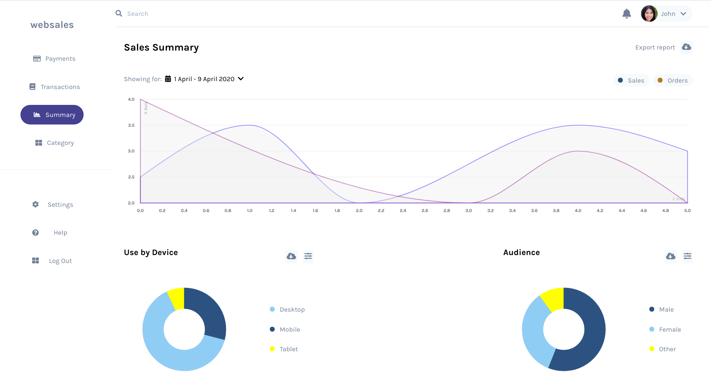

# websales-demo

  
  
A webpage concept made using tailwindcss (Currently not responsive)

<a href="http://gkdskp.github.io/frontend-demos/websales-demo/">
	<button style="padding: 12px 30px; background: blueviolet; border: 0; outline: 0; color: #fff; border-radius: 6px">Live Demo</button>
</a>

## Setting Up

```
Install requirements by running npm i

Scripts:
To run: npm start
To build: npm run build
```
