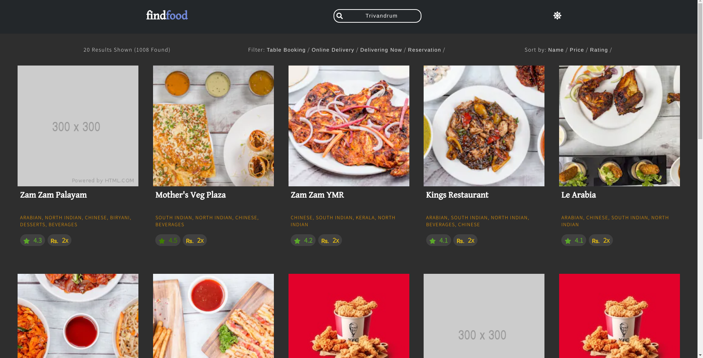

# zomato-frontend
  
  
A React App that lists all the hotels in a given location  
  
<a href="http://gkdskp.github.io/frontend-demos/zomato-frontend/">
	<button style="padding: 12px 30px; background: blueviolet; border: 0; outline: 0; color: #fff; border-radius: 6px;">Live Demo</button>
</a>

## Setting Up
```
Install requirements by running npm i
Add your Zomato API KEY in src/config.js

Scripts:
To run: npm start
To build: npm run build
```
